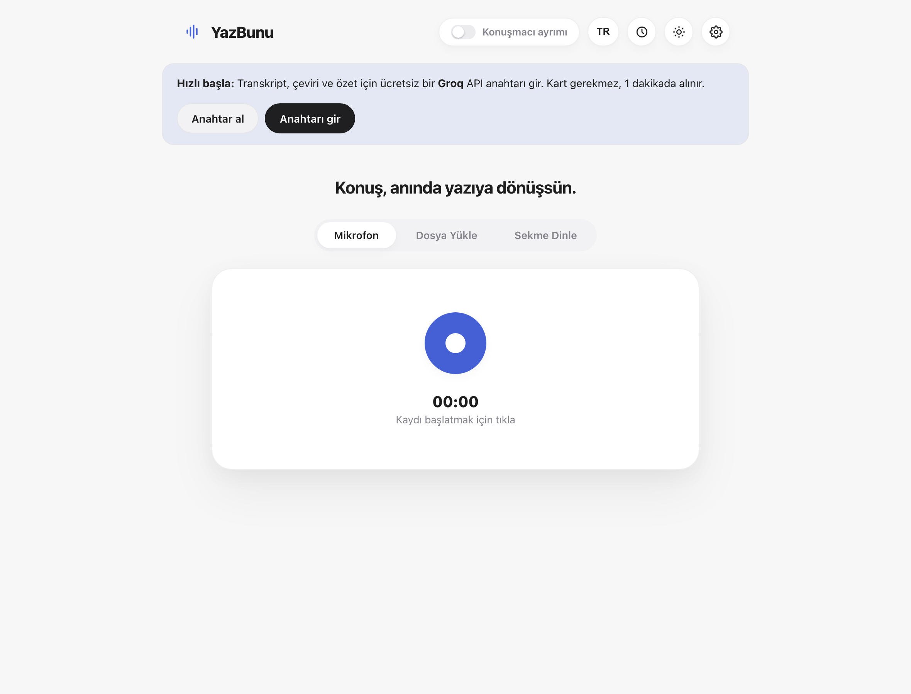
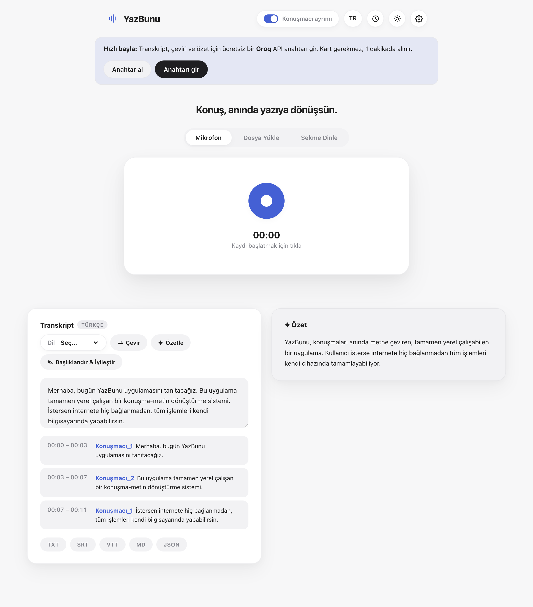
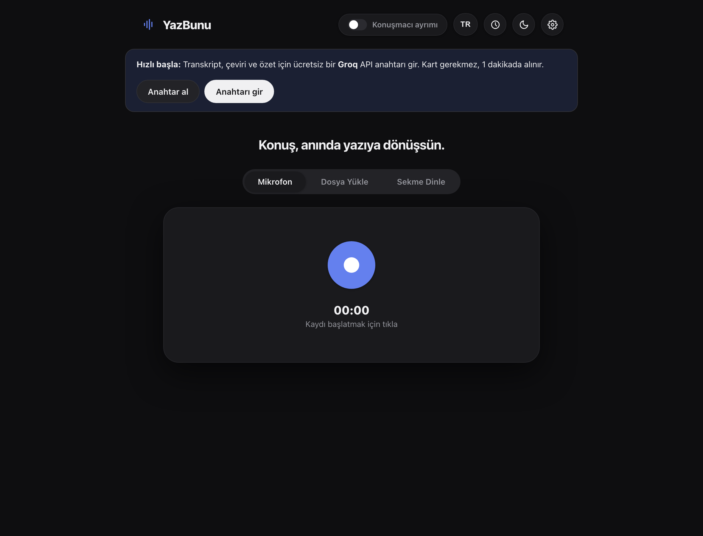
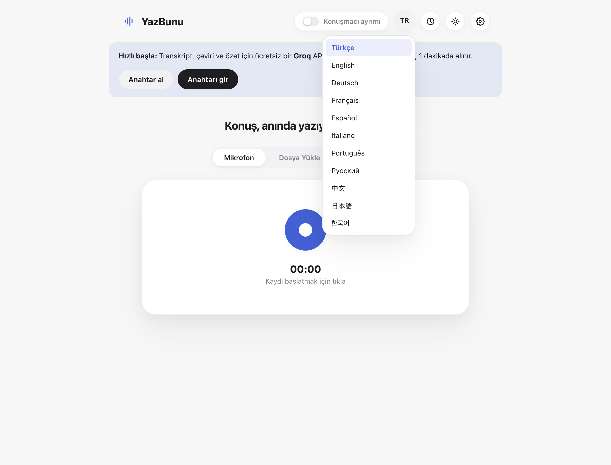
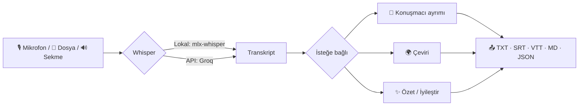
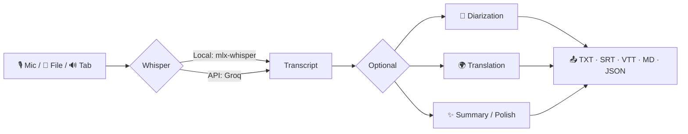

<div align="center">
  

  # YazBunu

  **Konuş, anında yazıya dönüşsün.** &nbsp;·&nbsp; **Speak, and watch it become text instantly.**

  [](https://www.python.org/)
  [](https://fastapi.tiangolo.com/)
  [](#-hızlı-başlangıç--quick-start)
  [](LICENSE)

  <a href="#-türkçe">🇹🇷 Türkçe</a> &nbsp;·&nbsp; <a href="#-english">🇬🇧 English</a>
</div>

<br>

<p align="center">
  
</p>

<br>

---

## 🇹🇷 Türkçe

**YazBunu**, konuşmaları anında metne dönüştüren, çeviri ve özetleme yapabilen, tamamen **yerelde çalışabilen** bir konuşma-metin uygulaması. Bir BTK Bitirme Projesi olarak başladı; şimdi herkesin klonlayıp kendi bilgisayarında (ya da tek bir ücretsiz API anahtarıyla herhangi bir cihazda) çalıştırabileceği bir araç.

İki mod sunar: **Apple Silicon Mac'lerde** her şeyi internete hiç dokunmadan cihazında çalıştırabilirsin; **her platformda** ücretsiz bir Groq API anahtarıyla saniyeler içinde deneyebilirsin.

### ✨ Özellikler

| | |
|---|---|
| 🎙️ **Mikrofon / Dosya / Sekme** | Canlı mikrofon kaydı, dosya yükleme, ya da tarayıcı sekmesindeki sesi dinleme — üç farklı giriş yolu |
| 👥 **Konuşmacı ayrımı** | "Kim ne zaman konuştu" — `pyannote` ile, her zaman yerel çalışır |
| 🌍 **Çeviri** | Transkripti 12 dile çevir (NLLB-200 yerel, ya da Groq API) |
| ✨ **Özetle & İyileştir** | Yapay zekâ ile kısa özet, başlıklı ve düzenli Markdown çıktısı |
| 🗂️ **Geçmiş** | Kayıtların otomatik saklanması, tekrar yükleme, var olan bir kayda sonradan ses ekleme |
| 🌐 **11 dilde arayüz** | Türkçe, English, Deutsch, Français, Español, Italiano, Português, Русский, 中文, 日本語, 한국어 |
| 📤 **5 farklı dışa aktarım** | TXT · SRT · VTT · Markdown · JSON |
| 🖥️ **Masaüstü uygulaması** | Tek tıkla başlat, tarayıcıdan "Yükle" ile Dock/Görev Çubuğu'na ekle |

### 🖼️ Ekran görüntüleri

<table>
<tr>
<td width="50%"></td>
<td width="50%">
  <br>
  
</td>
</tr>
</table>

### 🔒 Neden tamamen yerel?

Çünkü kaydettiğin konuşmalar seninkidir. **Lokal modda** — Apple Silicon bir Mac'te — transkript (`mlx-whisper`), çeviri (`NLLB-200`) ve konuşmacı ayrımı (`pyannote`) hiç internete çıkmadan, tamamen cihazında çalışır. **API modunda** ise Groq'un ücretsiz katmanı üzerinden, her platformda, kurulum derdi olmadan aynı deneyimi yaşarsın — tercih senin.



### 🚀 Hızlı başlangıç

```bash
git clone https://github.com/erensmsek/YazBunu.git
cd YazBunu
python3 -m venv venv
source venv/bin/activate          # Windows: venv\Scripts\activate
pip install -r requirements.txt
uvicorn server:app --host 127.0.0.1 --port 7860
```

`http://127.0.0.1:7860` adresini aç — bu kadar. Groq API anahtarını uygulama içindeki **Ayarlar**'dan girebilirsin ([ücretsiz anahtar al](https://console.groq.com/keys), kart gerekmez).

**Kod satırı yazmak istemiyorsan**: `YazBunu-Baslat.command` (macOS) / `.bat` (Windows) / `.sh` (Linux) dosyalarından işletim sistemine uygun olanına çift tıkla. Sistem gereksinimleri, sorun giderme ve masaüstü uygulaması olarak yükleme dahil detaylı adımlar için → **[RUN-GUIDE.md](RUN-GUIDE.md)**

### 🧩 Teknoloji

| Katman | Teknoloji |
|---|---|
| Backend | FastAPI (Python), tek process, build adımı yok |
| Transkript | `mlx-whisper` (large-v3-turbo, 8-bit, Apple Silicon) veya Groq Whisper API |
| Çeviri | `facebook/nllb-200-distilled-600M` veya Groq |
| Konuşmacı ayrımı | `pyannote.audio` — ağırlıklar repoya gömülü, harici indirme yok |
| Özet / İyileştirme | Groq (Llama/Qwen ailesi) |
| Frontend | Vanilla HTML/CSS/JS — framework yok, build adımı yok |

### 📄 Lisans

Bu proje [MIT lisansı](LICENSE) ile paylaşılmıştır. Diyarizasyon modeli ağırlıkları [pyannote projesi](https://github.com/pyannote/pyannote-audio)'nden CC-BY-4.0 lisansıyla vendor edilmiştir — bkz. [`models/diarization/ATTRIBUTION.md`](models/diarization/ATTRIBUTION.md).

<br>

---

## 🇬🇧 English

**YazBunu** ("Write This" in Turkish) is a speech-to-text app that transcribes, translates, and summarizes speech — and can run **entirely on your own device**. It started as a graduation project; now it's something anyone can clone and run, either fully offline on Apple Silicon or, with one free API key, on any machine.

It ships two modes: on an **Apple Silicon Mac**, run everything on-device with zero network calls; on **any platform**, try it in seconds with a free Groq API key.

### ✨ Features

| | |
|---|---|
| 🎙️ **Mic / File / Tab** | Live microphone recording, file upload, or listening to another browser tab's audio |
| 👥 **Speaker diarization** | "Who said what, when" — via `pyannote`, always runs locally |
| 🌍 **Translation** | Translate the transcript into 12 languages (local NLLB-200 or Groq API) |
| ✨ **Summarize & Polish** | AI-generated short summary, plus a titled, cleaned-up Markdown rewrite |
| 🗂️ **History** | Recordings auto-save, can be reloaded, or appended with more audio later |
| 🌐 **11-language UI** | Turkish, English, German, French, Spanish, Italian, Portuguese, Russian, Chinese, Japanese, Korean |
| 📤 **5 export formats** | TXT · SRT · VTT · Markdown · JSON |
| 🖥️ **Desktop app** | One-click launch, installable to your Dock/Taskbar right from the browser |

### 🖼️ Screenshots

<table>
<tr>
<td width="50%"></td>
<td width="50%">
  <br>
  
</td>
</tr>
</table>

### 🔒 Why local-first?

Because the conversations you record are yours. In **Local mode** — on an Apple Silicon Mac — transcription (`mlx-whisper`), translation (`NLLB-200`), and speaker diarization (`pyannote`) all run entirely on-device, no network calls involved. In **API mode**, you get the same experience on any platform through Groq's free tier — no setup friction. Your choice.



### 🚀 Quick start

```bash
git clone https://github.com/erensmsek/YazBunu.git
cd YazBunu
python3 -m venv venv
source venv/bin/activate          # Windows: venv\Scripts\activate
pip install -r requirements.txt
uvicorn server:app --host 127.0.0.1 --port 7860
```

Open `http://127.0.0.1:7860` — that's it. Add your Groq API key from the in-app **Settings** ([get a free key](https://console.groq.com/keys), no card required).

**Don't want to touch the command line?** Double-click `YazBunu-Baslat.command` (macOS) / `.bat` (Windows) / `.sh` (Linux) for your OS. For system requirements, troubleshooting, and installing as a desktop app, see → **[RUN-GUIDE.md](RUN-GUIDE.md)**

### 🧩 Tech stack

| Layer | Technology |
|---|---|
| Backend | FastAPI (Python), single process, no build step |
| Transcription | `mlx-whisper` (large-v3-turbo, 8-bit, Apple Silicon) or Groq Whisper API |
| Translation | `facebook/nllb-200-distilled-600M` or Groq |
| Diarization | `pyannote.audio` — weights vendored in-repo, no external download |
| Summarize / Polish | Groq (Llama/Qwen family) |
| Frontend | Vanilla HTML/CSS/JS — no framework, no build step |

### 📄 License

This project is shared under the [MIT license](LICENSE). Diarization model weights are vendored from the [pyannote project](https://github.com/pyannote/pyannote-audio) under CC-BY-4.0 — see [`models/diarization/ATTRIBUTION.md`](models/diarization/ATTRIBUTION.md).

<br>

<div align="center">

Made with 🎙️ in Turkey.

</div>
