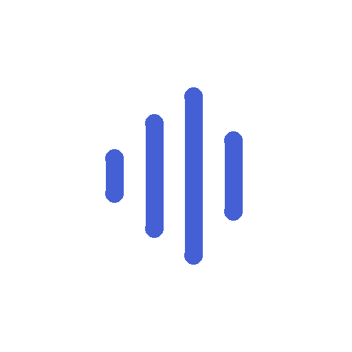
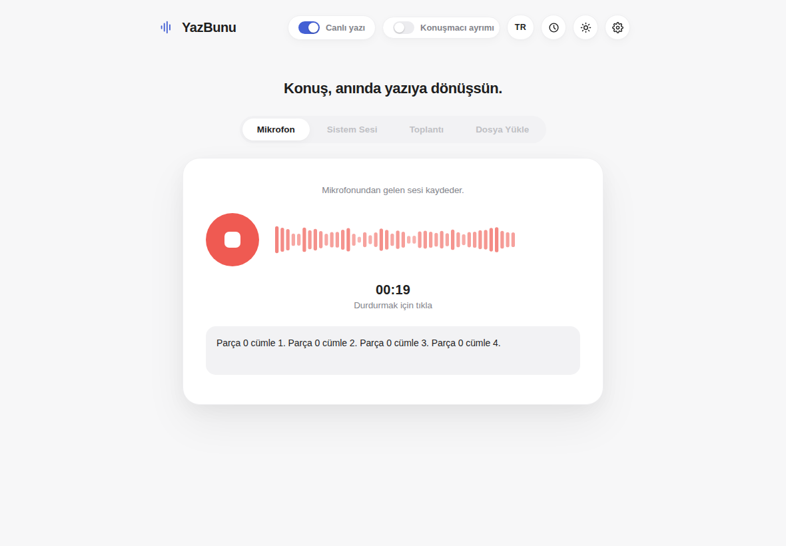
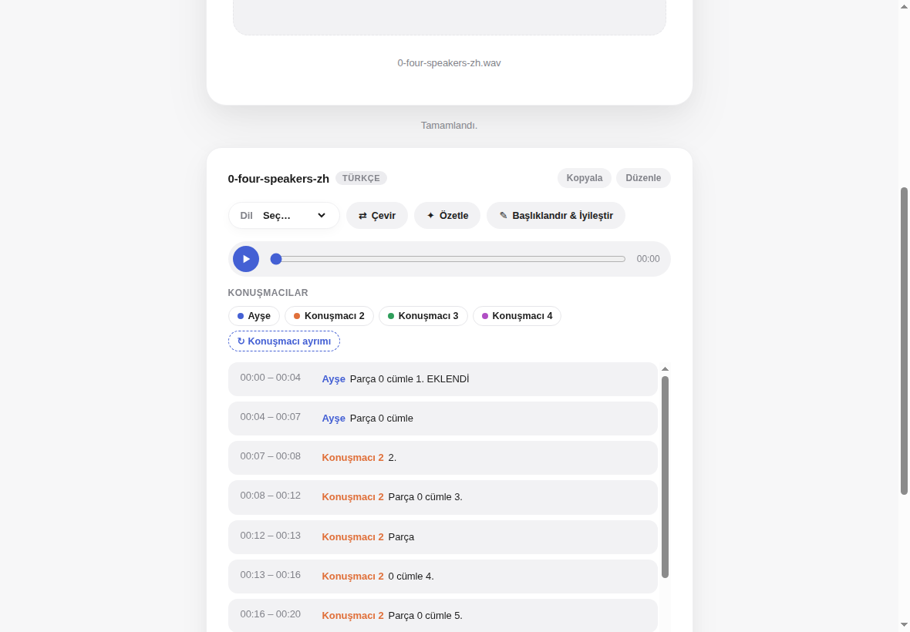
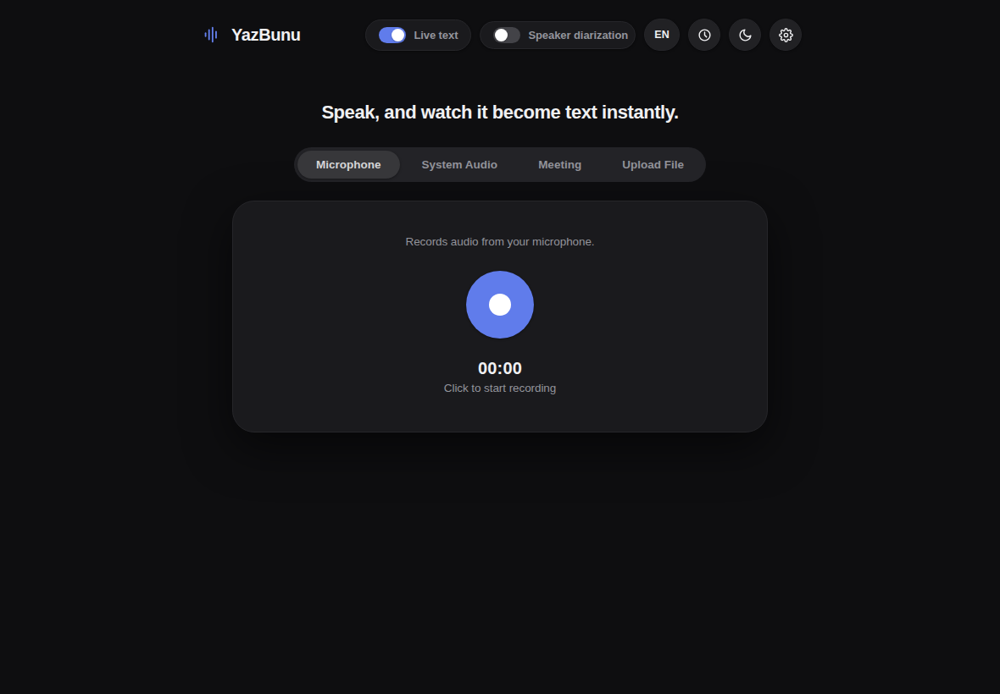
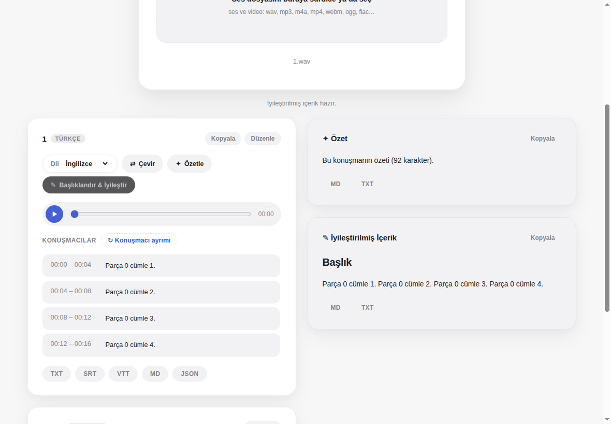
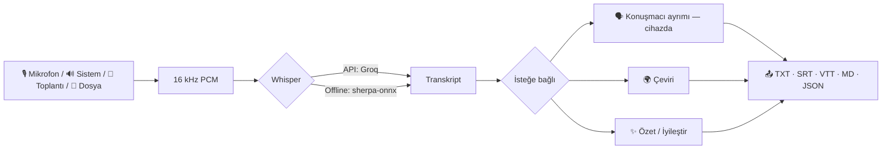

  

  # YazBunu

  **Konuş, anında yazıya dönüşsün.** &nbsp;·&nbsp; **Speak, and watch it become text instantly.**

  
  
  
  

  <a href="#-türkçe">🇹🇷 Türkçe</a> &nbsp;·&nbsp; <a href="#-english">🇬🇧 English</a>

 

  

---

## 🇹🇷 Türkçe

**YazBunu**, mikrofonu, bilgisayarda çalan sesi (toplantı, video) ya da bir ses/video dosyasını
ayrıntılı olarak yazıya döken; konuşmacıları ayıran, çeviren, özetleyen ve düzenli bir metne
dönüştüren bir **masaüstü uygulaması**. Windows, macOS ve Linux'ta kurulup çift tıklayarak açılır.
BTK Bitirme Projesi olarak web uygulaması şeklinde başladı; 2.0 ile tamamen masaüstüne taşındı.

### ✨ Özellikler

| | |
|---|---|
| 🎙️ **Mikrofon** | Canlı kayıt; konuştukça metin akar (canlı transkript) |
| 🔊 **Sistem sesi** | Bilgisayarda çalan her şey: Zoom/Teams/Meet, YouTube, tarayıcı |
| 👥 **Toplantı modu** | Mikrofon + sistem sesi birlikte — online toplantılar için |
| 📁 **Dosya** | wav, mp3, m4a, mp4/mov video, webm, ogg, flac… — saatlerce süren kayıtlar dahil |
| 🗣️ **Konuşmacı ayrımı** | "Kim ne zaman konuştu" — her zaman cihazda; konuşmacılara isim verilebilir |
| 🌍 **Çeviri** | 12 dile (Groq ya da internetsiz NLLB-200) |
| ✨ **Özetle & İyileştir** | Kısa özet ve başlıklı, düzenli Markdown — uzun kayıtlarda bölüm bölüm, kesintisiz |
| ✏️ **Düzenle & dinle** | Transkripti düzelt; segmente tıkla, sesin o anına git |
| 🗂️ **Geçmiş** | Diskte sınırsız geçmiş, arama, sonradan ses ekleme (konuşmacılar yeniden ayrılır) |
| 📴 **Offline mod** | Transkript + çeviri tamamen cihazda, **her platformda** (Whisper tiny → large-v3) |
| 📤 **Dışa aktarım** | TXT · SRT · VTT · Markdown · JSON |
| 🌐 **11 dilde arayüz** | Türkçe, English, Deutsch, Français, Español, Italiano, Português, Русский, 中文, 日本語, 한국어 |
| ⌨️ **Masaüstü** | Global kısayol (varsayılan `Ctrl/Cmd+Shift+Y`), tepsi ikonu, bildirimler |

### 🖼️ Ekran görüntüleri

<table>
<tr>
<td width="50%"></td>
<td width="50%"> </td>
</tr>
</table>

### 📥 Kurulum

[Releases](https://github.com/erensmsek/YazBunu/releases) sayfasından işletim sistemine uygun dosyayı indir:

| İşletim sistemi | Dosya | Not |
|---|---|---|
| 🍎 macOS (Apple Silicon) | `YazBunu-x.y.z-arm64.dmg` | İlk açılışta sağ tık → **Aç** (imzasız uygulama) |
| 🍎 macOS (Intel) | `YazBunu-x.y.z.dmg` | Offline çeviri Intel Mac'te yok (diğer her şey var) |
| 🪟 Windows 10/11 | `YazBunu-Setup-x.y.z.exe` | SmartScreen çıkarsa **Ek bilgi → Yine de çalıştır** |
| 🐧 Linux | `.AppImage` ya da `.deb` | Sistem sesi için `pulseaudio-utils` (PipeWire'da da çalışır) |

Açılınca **Ayarlar**'dan ücretsiz bir [Groq API anahtarı](https://console.groq.com/keys) gir (kart gerekmez).
Anahtar işletim sisteminin anahtar deposunda (Keychain / Windows DPAPI / libsecret) şifreli saklanır.
Ayrıntılar ve sorun giderme: **[RUN-GUIDE.md](RUN-GUIDE.md)**

### 🔌 İki mod

**API modu (varsayılan)** — Transkript, çeviri, özet ve iyileştirme Groq üzerinden çalışır; hızlıdır,
donanım fark etmez. Uzun kayıtlar ≤10 dakikalık parçalara sessiz anlardan bölünür, kota sınırına
takılınca uygulama bekleyip kendisi devam eder.

**Offline mod** — Transkript (Whisper) ve çeviri (NLLB-200) internete hiç çıkmadan bilgisayarında çalışır.
Model ilk kullanımda bir kez indirilir. Konuşmacı ayrımı her iki modda da her zaman cihazdadır.

```mermaid
flowchart LR
    A[🎙️ Mikrofon / 🔊 Sistem / 👥 Toplantı / 📁 Dosya] --> P[16 kHz PCM]
    P --> B{Whisper}
    B -->|API: Groq| C[Transkript]
    B -->|Offline: sherpa-onnx| C
    C --> D{İsteğe bağlı}
    D --> E[🗣️ Konuşmacı ayrımı — cihazda]
    D --> F[🌍 Çeviri]
    D --> G[✨ Özet / İyileştir]
    E & F & G --> H[📤 TXT · SRT · VTT · MD · JSON]
```

### 🧩 Teknoloji

| Katman | Teknoloji |
|---|---|
| Uygulama | Electron + TypeScript (main / preload / renderer), esbuild |
| Ses | AudioWorklet (16 kHz PCM), ffmpeg (dosyalar), PulseAudio `parec` (Linux sistem sesi) |
| Transkript | Groq Whisper `whisper-large-v3` ya da sherpa-onnx Whisper (int8, CPU) + Silero VAD |
| Konuşmacı ayrımı | sherpa-onnx: pyannote segmentation-3.0 + WeSpeaker ResNet34-LM (uygulamaya gömülü) |
| Çeviri | Groq (Qwen3) ya da transformers.js + NLLB-200 (ONNX) |
| Özet / İyileştirme | Groq (Qwen3; model kaldırılırsa yedek modeller) |
| Test | Vitest (unit + gerçek modellerle entegrasyon), Playwright + Electron (E2E) |

Geliştirme ve paket derleme: **[docs/BUILD.md](docs/BUILD.md)** · Mimari: **[docs/PLAN-DESKTOP.md](docs/PLAN-DESKTOP.md)**

### 📄 Lisans

[MIT](LICENSE). Üçüncü taraf bileşenler ve modeller: [build/THIRD_PARTY_NOTICES.md](build/THIRD_PARTY_NOTICES.md).
**Not:** İsteğe bağlı offline çeviri modeli NLLB-200, CC-BY-NC-4.0 lisanslıdır (ticari kullanım yok).

 

---

## 🇬🇧 English

**YazBunu** ("Write This" in Turkish) is a **desktop app** for Windows, macOS and Linux that turns
your microphone, your computer's audio (meetings, videos) or any audio/video file into a detailed
transcript — with speaker separation, translation, summaries and a polished Markdown rewrite.

### ✨ Features

| | |
|---|---|
| 🎙️ **Microphone** | Live recording with live transcript as you speak |
| 🔊 **System audio** | Anything playing on your computer: Zoom/Teams/Meet, YouTube, browser |
| 👥 **Meeting mode** | Microphone + system audio together |
| 📁 **Files** | wav, mp3, m4a, mp4/mov video, webm, ogg, flac… — including multi-hour recordings |
| 🗣️ **Speaker diarization** | Always on-device; rename speakers |
| 🌍 **Translation** | 12 languages (Groq or offline NLLB-200) |
| ✨ **Summarize & Polish** | Long recordings are processed in sections — never silently cut off |
| ✏️ **Edit & listen** | Fix the transcript; click a segment to jump to that moment in the audio |
| 🗂️ **History** | Unlimited on-disk history, search, append audio later |
| 📴 **Offline mode** | Transcription + translation fully on-device, **on every platform** |
| 📤 **Export** | TXT · SRT · VTT · Markdown · JSON |
| 🌐 **11-language UI** | Turkish, English, German, French, Spanish, Italian, Portuguese, Russian, Chinese, Japanese, Korean |
| ⌨️ **Desktop** | Global shortcut (`Ctrl/Cmd+Shift+Y`), tray icon, notifications |

### 📥 Install

Download the file for your OS from [Releases](https://github.com/erensmsek/YazBunu/releases)
(macOS `.dmg`, Windows `.exe`, Linux `.AppImage`/`.deb`), then add a free
[Groq API key](https://console.groq.com/keys) in **Settings**. The key is stored encrypted in your OS key store.
See **[RUN-GUIDE.md](RUN-GUIDE.md)** for details and troubleshooting, **[docs/BUILD.md](docs/BUILD.md)** to build from source.

### 📄 License

[MIT](LICENSE). Third-party components: [build/THIRD_PARTY_NOTICES.md](build/THIRD_PARTY_NOTICES.md).
The optional offline translation model NLLB-200 is CC-BY-NC-4.0 (non-commercial).

 

Made with 🎙️ in Turkey.

